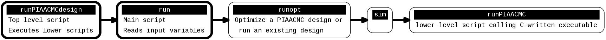

% PIAACMC design
% Olivier Guyon
% 2015-present

# Overview

## Scope

Diffraction-based PIAACMC simulation / optimization

- Uses Fresnel propagation engine ( OptSystProp.c OptSystProp.h ) between optical elements
- Computes linear perturbations around current design for optimization
- Automatically computes multiple Lyot stop to follow variable conjugation in different parts of the beam
- Polychromatic propagations
- Fits aspheric PIAA shapes on basis of radial cosines and 2-D Fourier modes

## Usage

Scripts to run the software are located within the source code directory:

	./src/PIAACMCsimul/scripts/

The scripts can be linked to your working directory by executing the following command:

	ln -s $PWD/syncscripts /myworkdirectory/syncscripts

Then, execute in your work directory:

	./syncscripts
	
This will install all required scripts in workdirectory and install any packages required.

Code is composed of a several layers (from high to low) :

-------------------- -----------------------------------------------------------
Script                   Description
-------------------- -----------------------------------------------------------
**run**                  Top level script, calls **runopt** script

**runopt**               Optimize a PIAACMC design or run an existing design
						calls **sim** script

**sim**                   calls **runPIAACMC** script

**runPIAACMC**            lower-level script calling C-written executable
-------------------- -----------------------------------------------------------

[Detailed description of script run](PIAACMCsimul_script_run.html)  
[Detailed description of script runopt](PIAACMCsimul_script_runopt.html)  
[Detailed description of script sim](PIAACMCsimul_script_sim.html)  
[Detailed description of script runPIAACMC](PIAACMCsimul_script_runPIAACMC.html)  

# Quick start

The quickest way to get started is to run and modify one of the example design scripts provided in the `./examples/` directory. The bash scripts should be self-explanatory. For further details about the design steps, read the design steps section.

---------------------------------- -----------------------------------------------------------
Script                             Description
---------------------------------- -----------------------------------------------------------
**exampleAPLCMC**                  Example APLCMC design (does not include PIAA optics)

**examplePIAACMC**                 Example PIAACMC design for a segmented aperture (2028x2048 arrays)
					
**examplePIAACMC_WFIRST1024**      Example PIAACMC design for the centrally obscured WFIRST pupil (1024x1024 arrays)
---------------------------------- -----------------------------------------------------------

# Design steps

## Overview

The design proceeds in discrete steps. The example scripts show the individual steps, and each step is executed with a separate command line. 

Steps from 0 to 99 are executed sequentially to design a monochromatic PIAACMC. For these steps, the user may run multiple steps with a single command. For example, running step 18 will execute all steps from 0 to 17 included. If a step has already been completed, it will not be re-run.

The monochromatic PIAACMC design process is as follows:

* design an idealized monochromatic PIAACMC for a centrally obscured aperture (steps 1-4)

* modify the design for the pupil aperture (steps 5-)

## STEP 000 (MODE=0): Create an idealized centrally obscured apodized PIAACMC monochromatic design

This is meant as a starting point for the PIAACMC, which will then be optimized further. This step takes a few minutes, and upon normal completion, display: 

~~~
./runPIAACMC REACHED STATE EXIT POINT (1)
~~~

The prolate function for a centrally obscured pupili is created, along with the idealized focal plane mask. The diffraction propagation code then computes complex amplitude in each plane.

This step takes a few minutes - most of the time is spent on iterations to compute the 2D apodization prolate function, executing discrete Fourier transforms (DFTs).

After this step, the contrast will likely be around 1e-7 to 1e-8. The next step to improve this nominal design is to find the optimal locations for the Lyot stops.

------------------------------------ -------------------------------------------------------------------------
Output file                          Description
------------------------------------ -------------------------------------------------------------------------
Cmodes_1024.fits                     Cosine modes applied for PIAA optics shapes optimization

Fmodes_1024.fits                     Fourier modes applied for PIAA optics shapes optimization

piaacmcconf_i000/WFamp0_xxx.fits     Amplitude in plane xxx

piaacmcconf_i000/WFpha0_xxx.fits     Phase in plane xxx

piaacmcconf_i000/conjugations.txt    List of planes and conjugation distance to reference

piaacmcconf_i000/apo2Drad.fits       Amplitude apodization (entirely allocated to PIAA optics)

piaacmcconf_i000/PIAA_Mshapes.txt    aspheric optics shapes (r0 z0 r1 z1), unit [m]

piaacmcconf_i000/piaam0z.fits        first PIAA mirror sag [m]

piaacmcconf_i000/piaam1z.fits        second PIAA mirror sag [m]

piaacmcconf_i000/psfi0_step000.fits  Coronagraphic PSF (flux normalized to total=1 without coronagraph)
------------------------------------ --------------------------------------------------------------------------

The conjugations.txt file should contain number, location and description of each plane:

~~~
00  0.000000    input pupil
01  0.000000    TT mirror
02  -1.102609   pupil plane apodizer
03  1.199997    PIAA optics 0
04  -1.102609   PIAA optics 1
05  -1.102609   opaque mask at PIAA elem 1
06  -1.102609   post focal plane mask pupil
07  0.000000    Lyot mask 0
08  0.000000    back end pupil stop  (rad = 0.920000)
~~~

The complex amplitude for each of these planes (files WFamp0_xxx.fits) should show the pupil apodization and coronagraphic effect induced by the focal plane mask which moves light into the central obstruction.

The script provides some approximate performance metrics upon normal exit:

~~~
saved -> test_psfc0a.fits
    FLUX   0    114332.0000 1.000000
    FLUX   1    114332.0000 1.000000
    FLUX   2    114331.9875 1.000000
    FLUX   3    114331.9736 1.000000
    FLUX   4    114331.9445 1.000000
    FLUX   5    114331.8632 0.999999
    FLUX   6     36330.5968 0.317764
    FLUX   7       552.3991 0.004832
    FLUX   8        95.3810 0.000834
COMPUTING UNRESOLVED SOURCE PSF -*- [0.000000 x 0.000000]
Peak constrast (rough estimate)= 3617.04 -> 2.76706e-07
optsyst[0].flux[0]  = 114332
SCORINGMASKTYPE = 0
[0] Total light in scoring field = 1.32039e+06, peak PSF = -1, SCOTINGTOTAL = 2436   -> Average contrast = 4.14658e-08
~~~

## STEP 001: Propagate solution and compute PSF

The previous solution is propagated. This should yield the same result as step 0. This should take approximately 1mn.

~~~
    FLUX   0    114332.0000 1.000000
    FLUX   1    114332.0000 1.000000
    FLUX   2    114331.9848 1.000000
    FLUX   3    114331.9558 1.000000
    FLUX   4    114331.9316 0.999999
    FLUX   5     36329.5003 0.317754
    FLUX   6       542.4649 0.004745
    FLUX   7        96.0420 0.000840
COMPUTING UNRESOLVED SOURCE PSF -*- [0.000000 x 0.000000]
Peak constrast (rough estimate)= 3025.69 -> 2.31467e-07
optsyst[0].flux[0]  = 114332
SCORINGMASKTYPE = 0
[0] Total light in scoring field = 1.3261e+06, peak PSF = -1, SCOTINGTOTAL = 2436   -> Average contrast = 4.1645e-08
~~~

## STEP 002: Specify input pupil geometry

The pupil geometry is copied to file `piaacmcconf_i000/pupa0_1024.fits`

## STEP 003 (mode = 0): compute on-axis PSF for new pupil geometry

Same as step 1, but taking into account the pupil geometry. With spiders or gaps in the pupil, the contrast will not be as good

~~~
    FLUX   0    416183.9306 1.000000
    FLUX   1    416183.9306 1.000000
    FLUX   2    416183.8669 1.000000
    FLUX   3    416183.7614 1.000000
    FLUX   4    416183.7012 0.999999
    FLUX   5    155983.4386 0.374794
    FLUX   6     32825.0378 0.078871
    FLUX   7     30509.7138 0.073308
COMPUTING UNRESOLVED SOURCE PSF -*- [0.000000 x 0.000000]
Peak constrast (rough estimate)= 2.74249e+07 -> 0.000158334
optsyst[0].flux[0]  = 416184
SCORINGMASKTYPE = 0
[0] Total light in scoring field = 7.35517e+09, peak PSF = -1, SCOTINGTOTAL = 2436   -> Average contrast = 1.74319e-05
~~~

This step should take approximately 1mn.

## STEP 004 (mode = 5): Compute Lyot stops shapes and locations, 1st pass

For circular centrally obscured pupils, the default Lyot stops configuration consists of two stops: one that masks the outer part of the beam, and one that masks the central obstruction.

Fine optimization of the stops locations is done with a separate command. The optional lsoptrange value is the range (unit: m) for the mask position search.

When the optimization completes, the best solutions are listed:

~~~
BEST SOLUTION: 0.000000000000 / 33.478288243056    0.000000556868 / 0.000044544711  -> 0.706241153417  0.019795686221
BEST SOLUTION: 6.695657648611 / 33.478288243056    0.000000556868 / 0.000044544711  -> 0.706237596354  0.019795151562
BEST SOLUTION: 7.365223413472 / 33.478288243056    0.000000556868 / 0.000044544711  -> 0.706219734865  0.019792653140
BEST SOLUTION: 8.034789178333 / 33.478288243056    0.000000556868 / 0.000044544711  -> 0.706026161578  0.019768034052
BEST SOLUTION: 8.704354943194 / 33.478288243056    0.000000556868 / 0.000044544711  -> 0.705220276320  0.019673042636
BEST SOLUTION: 9.373920708056 / 33.478288243056    0.000000556868 / 0.000044544711  -> 0.702039509211  0.019321456405
BEST SOLUTION: 32.808722478194 / 33.478288243056    0.000000668241 / 0.000044544711  -> 0.733651721375  0.019318291526
BEST SOLUTION: 33.478288243056 / 33.478288243056    0.000000668241 / 0.000044544711  -> 0.710514365016  0.018620791690
~~~

The optimal Lyot stop(s) conjugation(s) is written in file `piaacmcparams_step004.conf`

This step takes about 2hr.

## STEP 005 (mode = 2): Optimize focal plane mask transmission, 1st pass

Optimizes the focal plane mask transmission. Results are written in file `result_fpmt.log`

~~~
 0.031579 1.35944e-05  0 0.3 0.1
 0.131579 7.96891e-06  0 0.3 0.1
 0.231579 3.83775e-06  0 0.3 0.1
 0.331579 1.20092e-06  0 0.3 0.1
 0.431579 5.84203e-08  0 0.3 0.1
 0.531579 4.10247e-07  0 0.3 0.1
 0.631579 2.2564e-06  0 0.3 0.1

 0.341579 1.01943e-06  1 0.09 0.03
 0.371579 5.64602e-07  1 0.09 0.03
 0.401579 2.44266e-07  1 0.09 0.03
 0.431579 5.84203e-08  1 0.09 0.03
 0.461579 7.06368e-09  1 0.09 0.03
 0.491579 9.01969e-08  1 0.09 0.03
 0.521579 3.0782e-07  1 0.09 0.03

 0.434579 4.72326e-08  2 0.027 0.009
 0.443579 2.1739e-08  2 0.027 0.009
 0.452579 8.34926e-09  2 0.027 0.009
 0.461579 7.06368e-09  2 0.027 0.009
 0.470579 1.78822e-08  2 0.027 0.009
 0.479579 4.08046e-08  2 0.027 0.009
 0.488579 7.58315e-08  2 0.027 0.009

 0.453479 7.676e-09  3 0.0081 0.0027
 0.456179 6.38254e-09  3 0.0081 0.0027
 0.458879 6.17844e-09  3 0.0081 0.0027
 0.461579 7.06368e-09  3 0.0081 0.0027
 0.464279 9.03836e-09  3 0.0081 0.0027
 0.466979 1.21023e-08  3 0.0081 0.0027
 0.469679 1.62556e-08  3 0.0081 0.0027

 0.456449 6.31312e-09  4 0.00243 0.00081
 0.457259 6.17018e-09  4 0.00243 0.00081
 0.458069 6.12529e-09  4 0.00243 0.00081
 0.458879 6.17844e-09  4 0.00243 0.00081
 0.459689 6.32964e-09  4 0.00243 0.00081
 0.460499 6.57888e-09  4 0.00243 0.00081
 0.461309 6.92612e-09  4 0.00243 0.00081

 0.457340 6.16129e-09  5 0.000729 0.000243
 0.457583 6.14047e-09  5 0.000729 0.000243
 0.457826 6.12846e-09  5 0.000729 0.000243
 0.458069 6.12529e-09  5 0.000729 0.000243
 0.458312 6.13094e-09  5 0.000729 0.000243
 0.458555 6.14542e-09  5 0.000729 0.000243
 0.458798 6.16872e-09  5 0.000729 0.000243
~~~

This takes about 30mn

## STEP 006 (mode = 5): Compute Lyot stops shapes and locations, 2nd pass, 70% throughput

Takes about 10mn

## STEP 007 (mode = 40): Tune PIAA shapes and focal plane mask transm, 10 cosine modes, 5 Fourier modes

This takes approximately 20mn for size = 1024.\n
Progress can be tracked by watching file :
~~~
tail -f linoptval.txt
~~~

## STEP 008 (mode = 40): Tune PIAA shapes and focal plane mask transm,  20 cosine modes, 20 Fourier modes

~~~
    FLUX   0    416183.9306 1.000000
    FLUX   1    416183.9306 1.000000
    FLUX   2    416183.8669 1.000000
    FLUX   3    416183.7608 1.000000
    FLUX   4    416183.6991 0.999999
    FLUX   5    189642.2892 0.455669
    FLUX   6       216.7150 0.000521
    FLUX   7       216.7150 0.000521
COMPUTING UNRESOLVED SOURCE PSF -*- [0.000000 x 0.000000]
Peak constrast (rough estimate)= 6272.06 -> 3.62109e-08
optsyst[0].flux[0]  = 416184
SCORINGMASKTYPE = 0
[0] Total light in scoring field = 291196, peak PSF = -1, SCOTINGTOTAL = 2436   -> Average contrast = 6.90139e-10
~~~

This step takes 3 hr

## STEP 009 (mode = 5): Compute Lyot stops shapes and locations, 2nd pass, 70% throughput

This step takes approximately 4mn.

## STEP 010 (mode = 1): Tune Lyot stops conjugations

To view result:

~~~
tail -f result_LMpos.log
~~~

~~~
    FLUX   0    416183.9306 1.000000
    FLUX   1    416183.9306 1.000000
    FLUX   2    416183.8669 1.000000
    FLUX   3    416183.7608 1.000000
    FLUX   4    416183.6991 0.999999
    FLUX   5    189690.4898 0.455785
    FLUX   6       159.9713 0.000384
    FLUX   7       159.9713 0.000384
COMPUTING UNRESOLVED SOURCE PSF -*- [0.000000 x 0.000000]
Peak constrast (rough estimate)= 7922.02 -> 4.57368e-08
optsyst[0].flux[0]  = 416184
SCORINGMASKTYPE = 0
[0] Total light in scoring field = 298404, peak PSF = -1, SCOTINGTOTAL = 2436   -> Average contrast = 7.07224e-10
~~~

This step takes approximately 5mn.

## STEP 011 (mode = 40): Tune PIAA shapes and focal plane mask transm,  20 cosine modes, 20 Fourier modes

~~~
    FLUX   0    416183.9306 1.000000
    FLUX   1    416183.9306 1.000000
    FLUX   2    416183.8669 1.000000
    FLUX   3    416183.7605 1.000000
    FLUX   4    416183.6985 0.999999
    FLUX   5    192668.7345 0.462941
    FLUX   6       159.3355 0.000383
    FLUX   7       159.3355 0.000383
COMPUTING UNRESOLVED SOURCE PSF -*- [0.000000 x 0.000000]
Peak constrast (rough estimate)= 8636.87 -> 4.98638e-08
optsyst[0].flux[0]  = 416184
SCORINGMASKTYPE = 0
[0] Total light in scoring field = 209897, peak PSF = -1, SCOTINGTOTAL = 2436   -> Average contrast = 4.97461e-10
~~~

## STEP 012 (mode = 40): Tune PIAA shapes and focal plane mask transm,  40 cosine modes, 150 Fourier modes

~~~
The total number of free parameters is 380 = (40+150)*2, so this routine takes a long time to complete (hours).
    FLUX   0    416183.9306 1.000000
    FLUX   1    416183.9306 1.000000
    FLUX   2    416183.8669 1.000000
    FLUX   3    416183.7615 1.000000
    FLUX   4    416183.6991 0.999999
    FLUX   5    193239.3033 0.464312
    FLUX   6       159.4789 0.000383
    FLUX   7       159.4789 0.000383
COMPUTING UNRESOLVED SOURCE PSF -*- [0.000000 x 0.000000]
Peak constrast (rough estimate)= 306.006 -> 1.76669e-09
optsyst[0].flux[0]  = 416184
SCORINGMASKTYPE = 0
[0] Total light in scoring field = 29496.3, peak PSF = -1, SCOTINGTOTAL = 2436   -> Average contrast = 6.99069e-11
~~~

takes 4hr

## STEP 013 (mode = 5): Compute Lyot stops shapes and locations, 3nd pass, 70% throughput

takes 4mn

## STEP 014 (mode = 1): Tune Lyot stops conjugations

~~~
    FLUX   0    416183.9306 1.000000
    FLUX   1    416183.9306 1.000000
    FLUX   2    416183.8669 1.000000
    FLUX   3    416183.7615 1.000000
    FLUX   4    416183.6991 0.999999
    FLUX   5    193287.4013 0.464428
    FLUX   6       176.5218 0.000424
    FLUX   7       176.5218 0.000424
COMPUTING UNRESOLVED SOURCE PSF -*- [0.000000 x 0.000000]
Peak constrast (rough estimate)= 2220.58 -> 1.28202e-08
optsyst[0].flux[0]  = 416184
SCORINGMASKTYPE = 0
[0] Total light in scoring field = 147416, peak PSF = -1, SCOTINGTOTAL = 2436   -> Average contrast = 3.49379e-10
~~~

Takes 12mn

## STEP 015

# C code description

## PIAACMC_designcodes

The main function in the source code is PIAACMCsimul_exec(), which takes two arguments: the configuration index (usually a 3 digit integer) and the mode (integer) which describes the operation to be performed to the PIAACMC design.

------------ ---------------------------------------------------------------------------------------------------------------------
Mode		 Description
------------ ---------------------------------------------------------------------------------------------------------------------
0            Compute on-axis propagation for specified configuration. If configuration does not exist, create idealized monochromatic PIAACMC (intended to create a new index) and compute on-axis propagation

1            Optimize Lyot stop(s) locations (scan) 

2            Optimize focal plane mask transmission for idealized monochromatic PIAACMC (scan)

3            Run without focal plane mask (for testing and calibration)

4            Linear optimization around current design, free parameters = PIAA optics cosines shapes (track progress by looking at val.opt file)

5            Optimize Lyot stops shapes and positions

10           Setup polychromatic optimization

11           Compute polychromatic response to zones, store result in FPMresp

12           Search for best mask solution using FPMresp, random search

13           Optimize PIAA optics shapes and focal plane mask transmission (idealized PIAACMC)

40           Optimize PIAA optics shapes and focal plane mask transmission (idealized PIAACMC)

41           Optimize PIAA optics shapes and focal plane mask zones (polychromatic)

100          Evaluate current design: polychromatic contrast, pointing sensitivity

101          Transmission as a function of angular separation

200          Make focal plane mask OPD map
------------ ---------------------------------------------------------------------------------------------------------------------

The following variables can be set :

-------------------- ----------------------------------------------------------------------------------------------------------------
Variable		     Description
-------------------- -------------------------------------
PIAACMC_size         Array size (1024, 2048, etc...)

PIAACMC_pixscale     Pixel scale [m]

PIAACMC_dftgrid      Sampling interval in DFTs

PIAACMC_centobs0     Input central obstruction

PIAACMC_centobs1     Output central obstruction

PIAACMC_nblambda     Number of wavelength points

PIAACMC_resolved     1 if resolved source (3 points at r = 0.01 l/D, 120 deg apart)

PIAACMC_fpmtype      1 if physical mask, 0 if idealized mask

PIAACMC_FPMsectors   Number of sectors in focal plane mask

PIAACMC_NBrings      Number of rings in focal plane mask

PIAACMC_fpmradld     Focal plane mask outer radius
------------ ---------------------------------------------------------------------------------------------------------------------

# Initialization rules (function  PIAAsimul_initpiaacmc() )

* if configuration directory exists, use it and load configuration file ( function  PIAAsimul_loadpiaacmcconf ), otherwise, create it

* load/create Cmodes 

* load/create Fmodes

* load mode coefficients for piaa shapes if they exist. If not:
	
	* create radial apodization for centrally obscured idealized monochromatic PIAACMC
	
	* fit / extrapolate radial apodization profile with cosines
	
	* using above fit, create 2D radial sag for both PIAA optics ( -> PIAA_Mshapes.txt)
	
	* make 2D sag maps for both optics ( -> piaa0z.fits, piaa1z.fits)
	
	* fit 2D sag maps with Cmodes and Fmodes coefficients ( -> piaa0Cmodes, piaa0Fmodes, piaa1Cmodes, piaa1Fmodes )

* load/create focal plane mask zone map. This is the map that defines the geometry (which ring is where)

* load/create focal plane mask thickness array

* load/create focal plane mask transmission array

* load/create Lyot stops

### Code breakdown

- PIAACMCsimul_exec() :
	- PIAAsimul_initpiaacmcconf(): Load/Creates/initializes piaacmcconf structure and directory
		- perform default initialization
		- PIAAsimul_loadpiaacmcconf(): Loading PIAACMC configuration from "piaacmcconfxxx/piaacmcparams.conf" if it exists
		- Creating/loading Cmodes and Fmodes
		- IMPORT / CREATE PIAA SHAPES
			- create 2D prolate iteratively
			- PIAACMCsimul_load2DRadialApodization():fit PIAA shapes with Cosine modes
			- PIAACMCsimul_init_geomPIAA_rad(): compute radial PIAA sag from cosine apodization fit
			- PIAACMCsimul_mkPIAAMshapes_from_RadSag(): Make 2D sag shapes from radial PIAA sag
		- MAKE FOCAL PLANE MASK
		- MAKE LYOT STOPS
		- PIAAsimul_savepiaacmcconf(): save configuration
	- PIAACMCsimul_makePIAAshapes(): construct PIAA shapes from fitting coefficients
		- construct 2D PIAA mirror shapes from piaa0Cmodescoeff, piaa0Fmodescoeff, piaa1Cmodescoeff, piaa1Fmodescoeff
	- PIAACMCsimul_computePSF(): Compute PSF

### Output Files

APLCmaskCtransm.txt ??
fpm_ampl.fits
fpm_pha.fits
FPmask.tmp.fits 

#### Configuration : 

Output file	| Notes
----------------|-------------------------------------
./piaaconfxxx/piaacmcparams.conf | Configuration parameters
./piaaconfxxx/conjugations.txt	| Conjugations
./piaaconfxxx/lambdalist.txt  | list of wavelength values
./piaaconfxxx/pupa0_[size].fits	| input pupil (created by default if does not exist)

#### Wavefront Modes :

Output file	| Notes
----------------|-------------------------------------
Cmodes.fits	| circular radial cosine modes (40 modes, hard coded)
Fmodes.fits	| Fourier modes (625 modes = 10 CPA, hard coded)
./piaaconfxxx/ModesExpr_CPA.txt | modes definition
./piaaconfxxx/APOmodesCos.fits	| Cosine modes for fitting 2D apodization profile

#### PIAA mirrors, apodization, fits:

Output file	| Notes
----------------|-------------------------------------
./piaaconfxxx/APLCapo.1.400.0.300.info | file written by prolate generation function coronagraph_make_2Dprolate in coronagraphs.c
./piaaconfxxx/apo2Drad.fits	| idealized PIAACMC 2D apodization
./piaaconfxxx/piaam0z.fits	| PIAA M0 shape (2D sag)
./piaaconfxxx/piaam1z.fits	| PIAA M1 shape (2D sag)
./piaaconfxxx/PIAA_Mshapes.txt	| PIAA shapes (radial txt file, cols: r0, z0, r1, z1)
./piaaconfxxx/piaa0Fz.fits	| PIAA M0 shape, Fourier components (2D file)	
./piaaconfxxx/piaa1Fz.fits	| PIAA M1 shape, Fourier components (2D file)
./piaaconfxxx/piaa0Cmodes.fits  | idealized PIAACMC mirror 0 cosine modes (copied from ./piaaref/)
./piaaconfxxx/piaa0Fmodes.fits  | idealized PIAACMC mirror 0 Fourier modes (copied from ./piaaref/)
./piaaconfxxx/piaa1Cmodes.fits  | idealized PIAACMC mirror 1 cosine modes (copied from ./piaaref/)
./piaaconfxxx/piaa1Fmodes.fits  | idealized PIAACMC mirror 1 Fourier modes (copied from ./piaaref/)
./piaaconfxxx/piaa0Cres.fits	| idealized PIAA M0 cosine fit residual
./piaaconfxxx/piaa1Cres.fits	| idealized PIAA M1 cosine fit residual
./piaaconfxxx/piaa0Cz.fits	| idealized PIAA M0 cosine fit sag
./piaaconfxxx/piaa1Cz.fits	| idealized PIAA M1 cosine fit sag
./piaaconfxxx/piaa0Fz.fits	| idealized PIAA M0 Fourier fit sag
./piaaconfxxx/piaa1Fz.fits	| idealized PIAA M1 Fourier fit sag

#### Idealized PIAACMC reference point:

Output file	| Notes
----------------|-------------------------------------
./piaaconfxxx/piaaref/APLCmaskCtransm.txt | idealized PIAACMC focal plane mask transmission
./piaaconfxxx/piaaref/apo2Drad.fits	| idealized PIAACMC output apodization
./piaaconfxxx/piaaref/piaa0Cmodes.fits  | idealized PIAACMC mirror 0 cosine modes
./piaaconfxxx/piaaref/piaa0Fmodes.fits  | idealized PIAACMC mirror 0 Fourier modes
./piaaconfxxx/piaaref/piaa1Cmodes.fits  | idealized PIAACMC mirror 1 cosine modes
./piaaconfxxx/piaaref/piaa1Fmodes.fits  | idealized PIAACMC mirror 1 Fourier modes

#### Focal plane mask:

Focal plane mask design defined by :
- [s] Sectors flag (0: no sectors, 1: sectors), variable PIAACMC_FPMsectors
- [r] Resolved target flag (0: point source, 1: resolved source)
- [mr] Mask radius in units of 0.1 l/D
- [rrr] number of rings, variable piaacmc[0].NBrings
- [zzz] number of zones

Output file	| Notes
----------------|-------------------------------------
fpmzmap[s]_[rrr]_[zzz].fits | Zones map
fpm_zonea[r][s]_[mr]_[rrr]_[zzz].fits | amplitude for each zone
fpm_zonea[r][s]_[mr]_[rrr]_[zzz].fits | thickness for each zone

IDEALIZED OR PHYSICAL MASK\n

Idealized mask is a single zone mask with thickness adjusted for lambda/2 phase shift and a (non-physical) partial transmission.
Physical mask consist of 1 or more zones with full transmission. Each zone can have a different thickness.

By default, a non-physical mask is first created with transmission piaacmc[0].fpmaskamptransm read from piaacmcparams.conf.
Computations indices using a physical mask:
- set transmission to 1.0:  piaacmc[0].fpmaskamptransm = 1.0.
- set focal plane mask radius to larger value: piaacmc[0].fpmRad = 0.5*(LAMBDASTART+LAMBDAEND)*piaacmc[0].Fratio * PIAACMC_MASKRADLD

#### Lyot stops:

Output file	| Notes
----------------|-------------------------------------
./piaaconfxxx/LyotStop0.fits	| Lyot Stop 0
./piaaconfxxx/LyotStop1.fits	| Lyot Stop 1

#### Amplitude & Phase at planes:

Files are /piaaconfxxx/WFamp_nnn.fits and WFpha_nnn.fits, where nnn is the plane index.\n
Complex amplitude is shown AFTER the element has been applied, in the plane of the element.\n

Plane index  	| description
----------------|-------------------------------------
000	|	Input pupil
001	|	Fold mirror used to induce pointing offsets
002	|	PIAA M0
003	|	PIAA M1
004	|	PIAAM1 edge opaque mask
005	|	post-focal plane mask pupil
006	|	Lyot Stop 0
007	|	Lyot Stop 1
008	|	invPIAA1
009	|	invPIAA0
010	|	back end mask

#### Performance Evaluation:

Plane index 	| description
----------------|-------------------------------------
./piaaconfxxx/scoringmask0.fits | Evaluation points in focal plane, hardcoded in PIAACMCsimul_computePSF()
./piaaconfxxx/CnormFactor.txt | PSF normalization factor used to compute contrast
./piaaconfxxx/flux.txt	| total intensity at each plane

# Low-level C code

## Key functions

Every time a PSF is computed, the following 3 functions are created in that order:

- `PIAAsimul_initpiaacmcconf`
	- initialize piaacmc
	- create modes for aspheric optical surfaces description
	- CREATE DMs (Cmodes and Fmodes)
	- IMPORT / CREATE PIAA SHAPES
	- if does not exist: Creating 2D apodization for idealized circular monochromatic PIAACMC
	- compute radial PIAA sag, make 2D sag maps
	- MAKE FOCAL PLANE MASK
	- MAKE LYOT STOPS (LOADING/CREATING LYOT MASK)
	
- `PIAACMCsimul_init(piaacmc, 0, xld, yld)` : initializes optical system to piaacmc design

- `PIAACMCsimul_makePIAAshapes(piaacmc, 0)` : create 2D PIAA shapes (`piaam0z` and `piaam1z`) from coefficient values and modes

- `OptSystProp_run(optsyst, 0, startelem, optsyst[0].NBelem, piaacmcconfdir, 0)` : perform optical propagation

Note that the last 3 functions are wrapped togeter in the computePSF function, which allows multi-point (extended sources) :

- `PIAACMCsimul_computePSF(float xld, float yld, long startelem, long endelem, int savepsf, int sourcesize, int extmode, int outsave)` : compute PSF
	- `PIAACMCsimul_init(piaacmc, 0, xld+rad1, yld)`
	- `PIAACMCsimul_makePIAAshapes(piaacmc, 0)`
	- `OptSystProp_run(optsyst, 0, startelem, optsyst[0].NBelem, piaacmcconfdir, 0)`

## Full PIAACMC design in monochromatic light

The first step of the optimization process is to compute the PIAACMC optics and focal plane mask in the idealized case: monochromatic light, point source, and ideal focal plane mask (circular, phase-shifting and partially transmissive). Steps are shown in the figure below and correspond to steps in the `runPIAACMC` state machine.

## APLC design

The scripts produce an APLC design by setting `PIAAmode = 0`. In that case, only `step000` in the figure above is executed.

## Focal plane mask optimization

### Overall flow

FPM optimization is done as `mode = 13` in the main routine. It is called from the `runPIAACMC` script.  
The `PIAACMCsimul_run(char *confindex, long mode)` function loop-calls the `PIAACMCsimul_exec(char *confindex, long mode)` function with mode 13 until search time is reached.

Each search proceeds as follows :

- a starting point is picked. A random integer `zeroST` encodes the starting poing:
	- 0: 
	- 1: start at zero
	- 2: start at best solution
	
- run `PIAACMCsimul_exec` in mode 13
	- randomly move next to starting point
	- compute value and store it to valref variable
	- enter gradient search loop
		- compute local derivatives
		- compute SVD of Jacobian matrix to identify vectors of steepest descent
		- for each alphareg = 0, 0.25, 0.5, 0.75, 1.0:
			- do a linescan descent along the vector identified by SVD, with the alphareg regularization coefficient
			- the best value is stored as `bestval` and the corresponding parameters into `data.image[IDoptvec].array.F[i]`
			- store best values in `PIAACMCSIMUL_VAL`, and reference value in `PIAACMCSIMUL_VALREF`
		

- `computePSF_FAST_FPMresp = 1` : uses pre-computed complex amplitude zones response to evaluate FPM solutions
- `PIAACMC_FPM_FASTDERIVATIVES = 1`

To stop the optimization and have the current best solution adopted, enter a small value in the `searchtime.txt` file, so that the optimization process completes.

### Regularization

There are two regularization:

- Focal plane mask zone sags can be included in the linear optimization as extra components to the optimization vector
- PIAA shapes coefficients are simply added to the evaluation metric

### Key files

- `fpm_zonez_.....best.fits` is the optimal solution
- `mode13_....bestval.txt` is the corresponding value

To restart the optimization from scratch, remove these two files.

Average contrast = 5.964e-05
0.001 -> Average contrast = 8.57575e-07, 1.9e-7
0.01  -> Average contrast = 7.99085e-07, 2.0e-7
7.8294e-07

